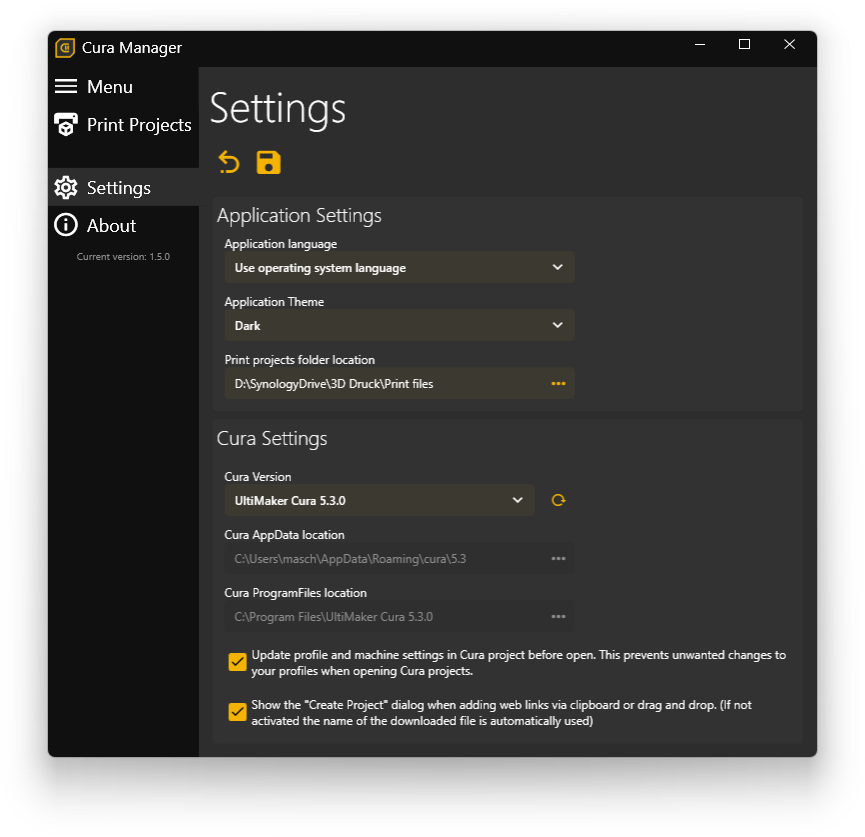
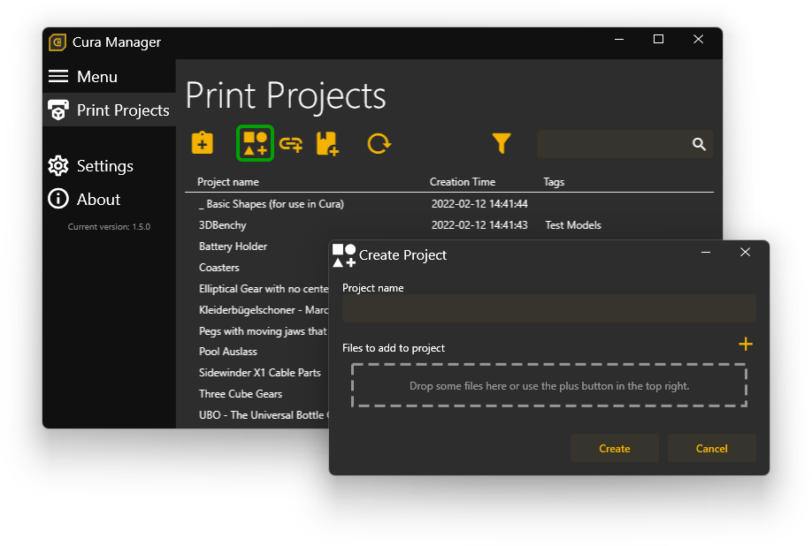
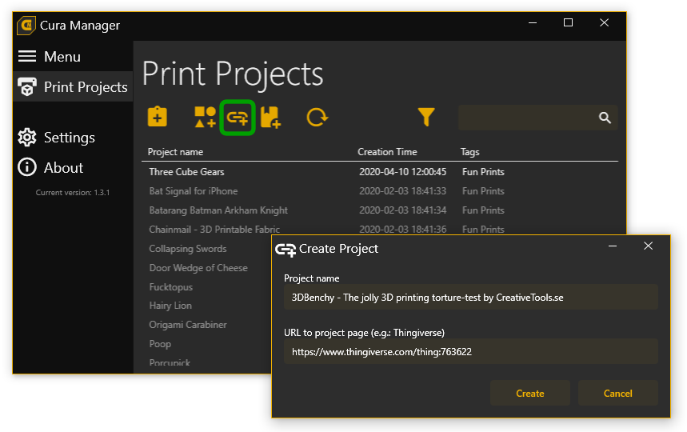
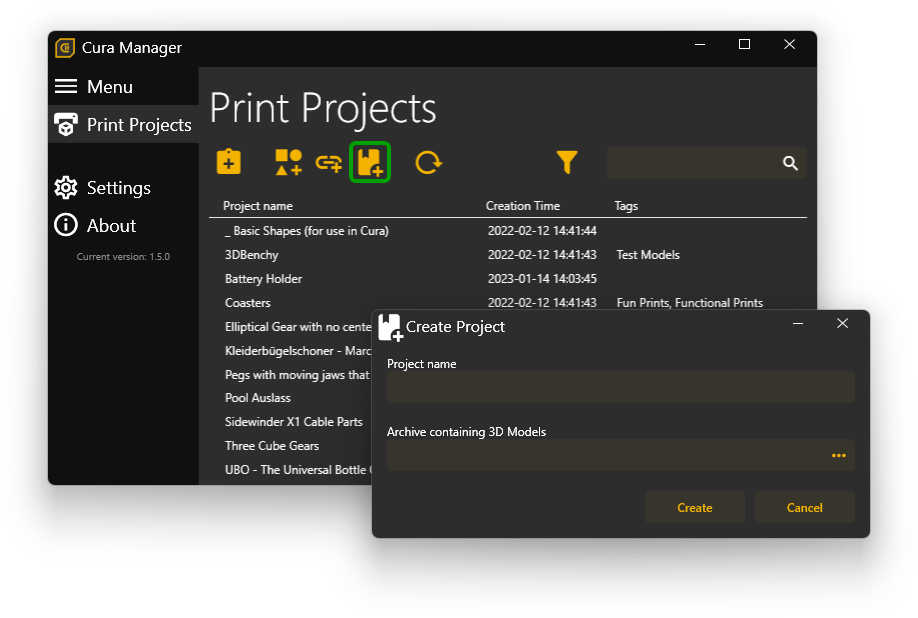
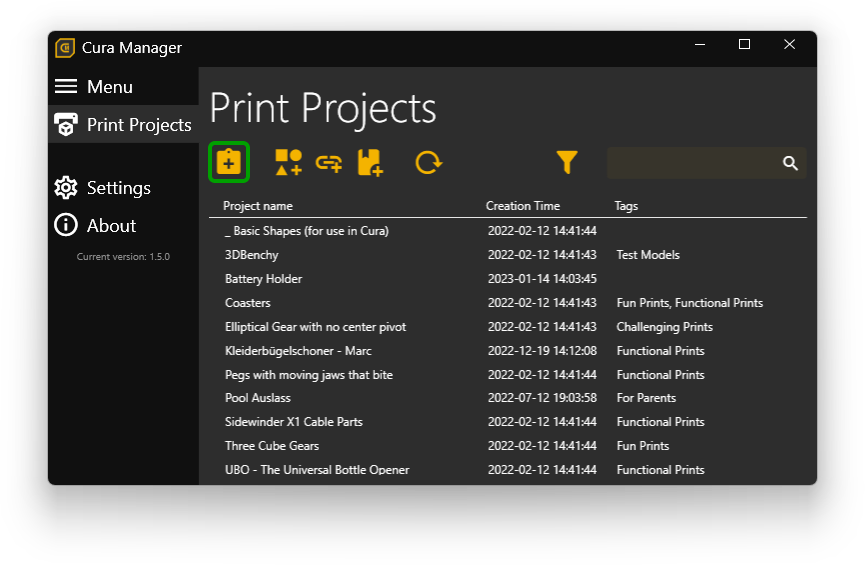
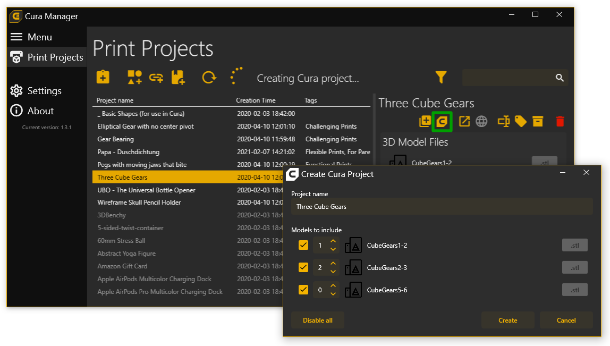
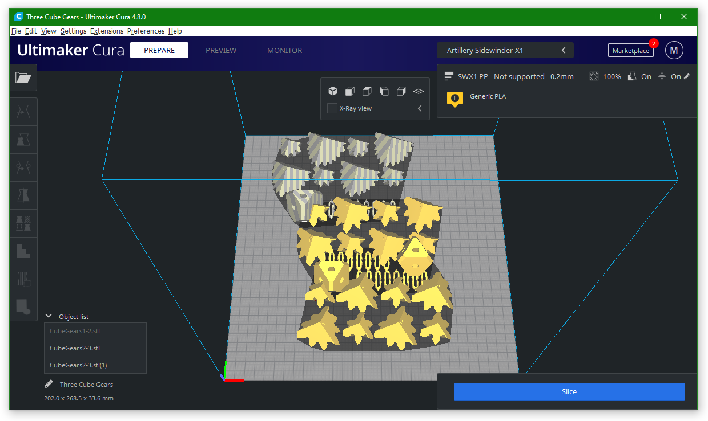

# Cura Manager
Application to manage 3D Prints using UltiMaker Cura, Anycubic Slicer Next, or OrcaSlicer.

## 🚀 Build Status

## 🐱‍🏍 Getting Started

Just download and extract the ZIP file from the [latest release](https://github.com/MaSch0212/cura-manager/releases/latest) to some folder and start the `CuraManager.exe`. 
The first time you start the application, you need to provide the following settings:
- **Print projects folder location** 
  Select a folder in which the print projects and all 3D models should be created. This can be some local folder, a Windows share or a folder that is used for some cloud storage provider like Microsoft OneDrive.
- **Slicers** 
  On the settings page, enable each slicer you want to use with CuraManager (UltiMaker Cura, Anycubic Slicer Next and OrcaSlicer are currently supported). For every slicer you enable, pick one of the detected installations, or select "Custom" to provide the required paths manually. If you enable more than one slicer, you can choose which one is active on the "Print Projects" page. Note that the "Create new project" button stays disabled until at least one slicer is enabled.

> **Note:** All screenshots in this README, including further down on this page, are from an older, Cura-only version of CuraManager and do not yet reflect the current multi-slicer UI.

## 🏆 Features

### ✨ Create 3D printing projects

A 3D Printing project can be created from a bunch of sources using the menu buttons on the "Print Projects" menu entry.

#### 🗿 From 3D model files

If you just have some 3D models that you want to combine into a project (e.g. you created the models on your own), you can do that using the "Create Project from Models..." button. 
Give the project a name and add the 3D models by either using drag 'n' drop or selecting the models using the "+" button. 

#### 🔗 From web link

You want to just download some models from you favorite 3D model site? You can easily do that using the "Create Project from the Web..." button. 
Currently links from the following websites are supported:
- [Thingiverse](https://www.thingiverse.com/)
- ~~[MyMiniFactory](https://www.myminifactory.com/)~~ (currently not working due to forced login)
- [YouMagine](https://www.youmagine.com/)

After pressing the "Create" button all files from the given link are downloaded and added to the project. 

#### 📦 From ZIP archive containing 3D models

If you got a ZIP archive containing 3D models you can just import that into Cura Manager as well by using the "Create Project from ZIP..." button. 
After giving the project a name and selecting a ZIP archive, the file are being extracted and added to the new project 

#### 📋 From clipboard

As a shortcut you can also just copy a link, one or more 3D model files or a ZIP archive file to the clipboard and press the "Create Project from Clipboard..." button. This will automatically decide what project type is correct and creates it for you. 

### 📁 Manage 3D printing projects

All print projects are shown in a grid inside the "Print Projects" menu entry. You can see the project names, when it has been created and the associated tags. 
You can sort the projects by name or creation date.

#### 💼 Archive projects

If you are done printing a project and do not need it anymore, just archive it. It is really handy to keep old print projects if you want to print it again in the future. By archiving a project, it is still shown in the list, but with a gray text. Also archived projects are always displayed after non-archived projects.

#### 🔖 Add tags to projects

To better filter for specific project types, you can create tags. You can create multiple tags and also associate multiple tags to one project. You can then easily filter for tags in the project list to see only projects with specific tags.

### 🌈 Create a project in your slicer

When you have created some projects in Cura Manager, you can easily create a slicer project for it by pressing the active slicer's icon on the project. If you have more than one slicer enabled, use the picker in the "Print Projects" toolbar first to choose which slicer is active. 
You will get a dialog to select the models you want and how many of each you want in the slicer project. If the legacy automatic project naming option is enabled (see "⚠️ Legacy features" below), the dialog also lets you set a project name there. After you press "Create", the active slicer is started with all the models you selected, and, if that legacy option is enabled, the project name is set for you as well. 
 

You can now set your print settings and start printing.

Also you probably want to save the project. CuraManager points the slicer's "Save Project" dialog directly at the correct directory for your print project, so you just need to press "Save" without changing anything else — the exact menu entry to get there depends on the slicer (e.g. "File" -> "Save Project..." in Cura).

## ⚠️ Legacy features

### 🏷️ Automatic project naming in Cura

Earlier versions of CuraManager always asked for a project name when creating a Cura project and set that name inside the Cura project itself. This is now an optional legacy feature that only applies to UltiMaker Cura (no Orca-family slicer has a project name field or command-line argument):
- If you are upgrading from an earlier version, it stays **enabled** so your existing workflow does not change.
- New installations start with it **disabled**. In that case, the create-project dialog no longer asks for a project name.
- You can toggle it at the bottom of the settings page.

This option is deprecated and will be removed in version 2.0.
