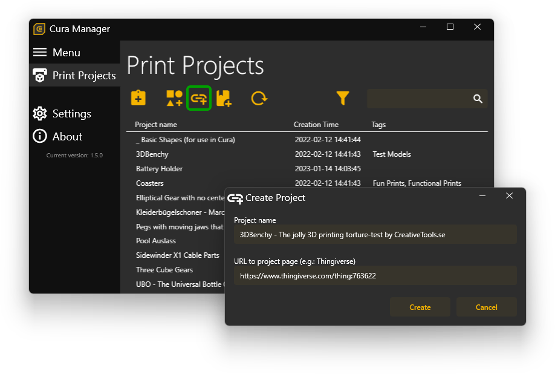
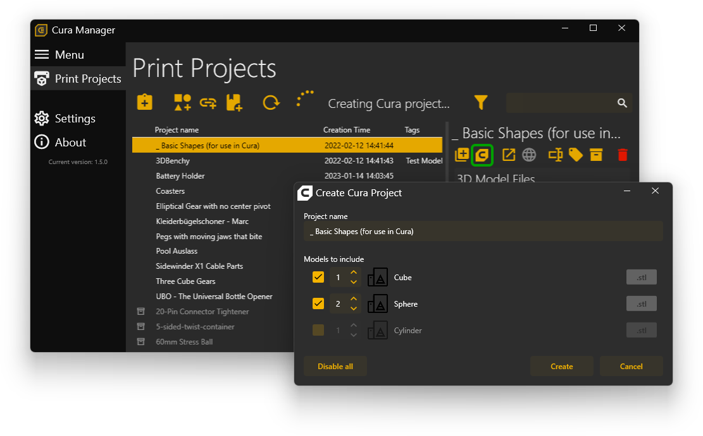
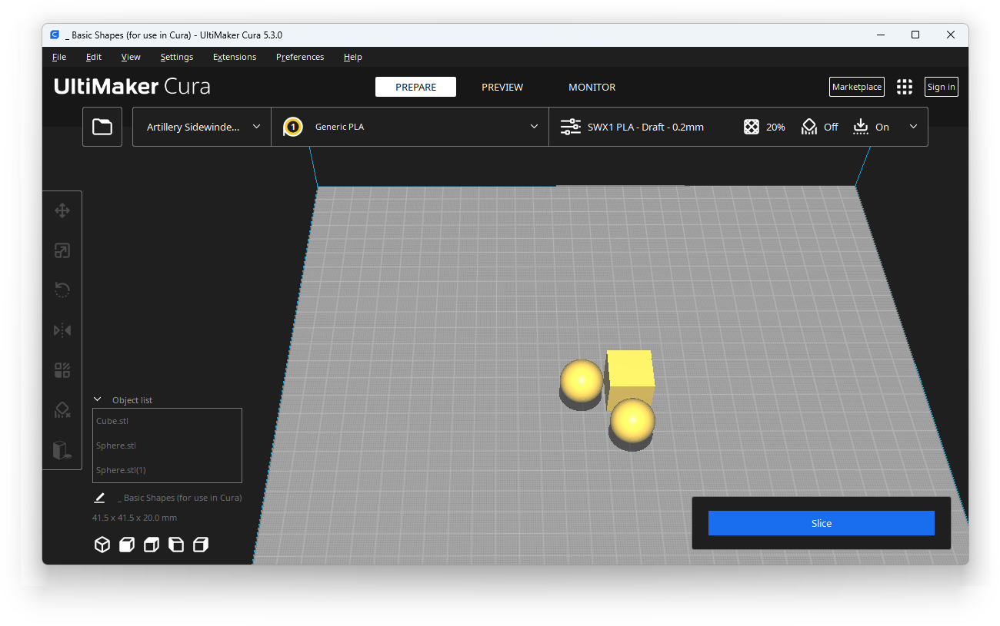

# Cura Manager
Application to manage 3D Prints using the Ultimaker Cura Slicer.

## 🚀 Build Status

## 🐱‍🏍 Getting Started

Just download and extract the ZIP file from the [latest release](https://github.com/MaSch0212/cura-manager/releases/latest) to some folder and start the `CuraManager.exe`. 
The first time you start the application, you need to provide the following settings:
- **Print projects folder location** 
  Select a folder in which the print projects and all 3D models should be created. This can be some local folder, a Windows share or a folder that is used for some cloud storage provider like Microsoft OneDrive.
- **Cura AppData location** 
  Select the AppData folder to the Cura version you want to use with CuraManager. This is normally in a folder like this: `C:\Users\<username>\AppData\Roaming\cura\<version>`.
- **Cura ProgramFiles location** 
  Select the installation directory of the Cura version you want to use with CuraManager. This is normally in a folder like this: `C:\Program Files\Ultimaker Cura <version>`.

## 🏆 Features

### ✨ Create 3D printing projects

A 3D Printing project can be created from a bunch of sources using the menu buttons on the "Print Projects" menu entry.

#### 🗿 From 3D model files

If you just have some 3D models that you want to combine into a project (e.g. you created the models on your own), you can do that using the "Create Project from Models..." button. 
Give the project a name and add the 3D models by either using drag 'n' drop or selecting the models using the "+" button. 

#### 🔗 From web link

You want to just download some models from you favorite 3D model site? You can easily do that using the "Create Project from the Web..." button. 
Currently links from the following websites are supported:
- [Thingiverse](https://www.thingiverse.com/)
- ~~[MyMiniFactory](https://www.myminifactory.com/)~~ (currently not working due to forced login)
- [YouMagine](https://www.youmagine.com/)

After pressing the "Create" button all files from the given link are downloaded and added to the project. 

#### 📦 From ZIP archive containing 3D models

If you got a ZIP archive containing 3D models you can just import that into Cura Manager as well by using the "Create Project from ZIP..." button. 
After giving the project a name and selecting a ZIP archive, the file are being extracted and added to the new project 

#### 📋 From clipboard

As a shortcut you can also just copy a link, one or more 3D model files or a ZIP archive file to the clipboard and press the "Create Project from Clipboard..." button. This will automatically decide what project type is correct and creates it for you. 

### 📁 Manage 3D printing projects

All print projects are shown in a grid inside the "Print Projects" menu entry. You can see the project names, when it has been created and the associated tags. 
You can sort the projects by name or creation date.

#### 💼 Archive projects

If you are done printing a project and do not need it anymore, just archive it. It is really handy to keep old print projects if you want to print it again in the future. By archiving a project, it is still shown in the list, but with a gray text. Also archived projects are always displayed after non-archived projects.

#### 🔖 Add tags to projects

To better filter for specific project types, you can create tags. You can create multiple tags and also associate multiple tags to one project. You can then easily filter for tags in the project list to see only projects with specific tags.

### 🌈 Create Cura project

When you have created some projects in Cura Manager you can easily create a Cura project, but pressing the Cura symbol of a project. You will get a dialog to select the models you want and how many of each you want in the Cura project as well as the name. After you press "Create", Cura is started with all the models you selected and the projects name in Cura is set as you specified in Cura Manager. 
 

You can now set your print settings and start printing.

Also you probably want to save the Cura project. You can simply click "File" -> "Save Project..." in Cura and you will see, that the file explorer that opens is directly in the correct directory for your print project. So you just need to press "Save" in that dialog without doing anything else.
